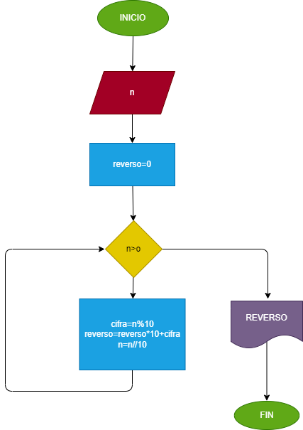

# Ejericio 2 Numero inverso 

Hacer el diagrama de flujo y el programa en python que lea un número entero y positivo, de cualquier número de dígitos, que calcule su número inverso y que lo imprima junto con el número leído.

